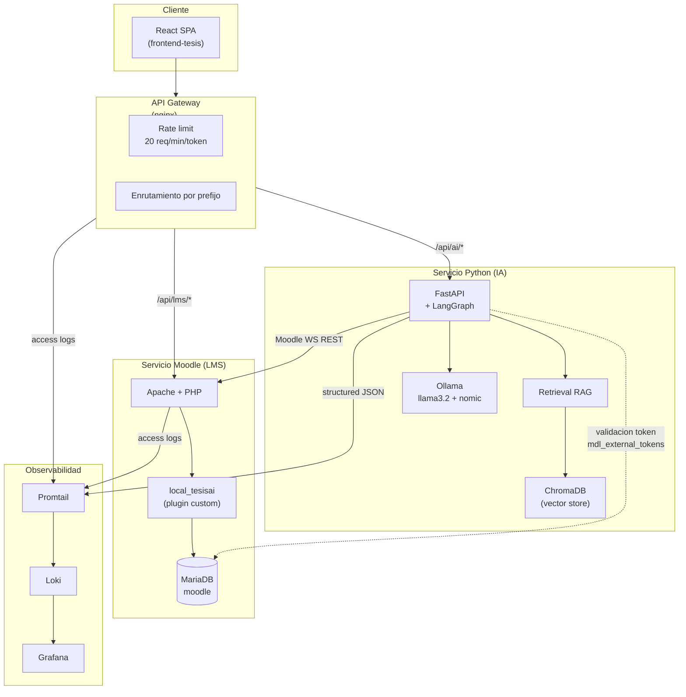
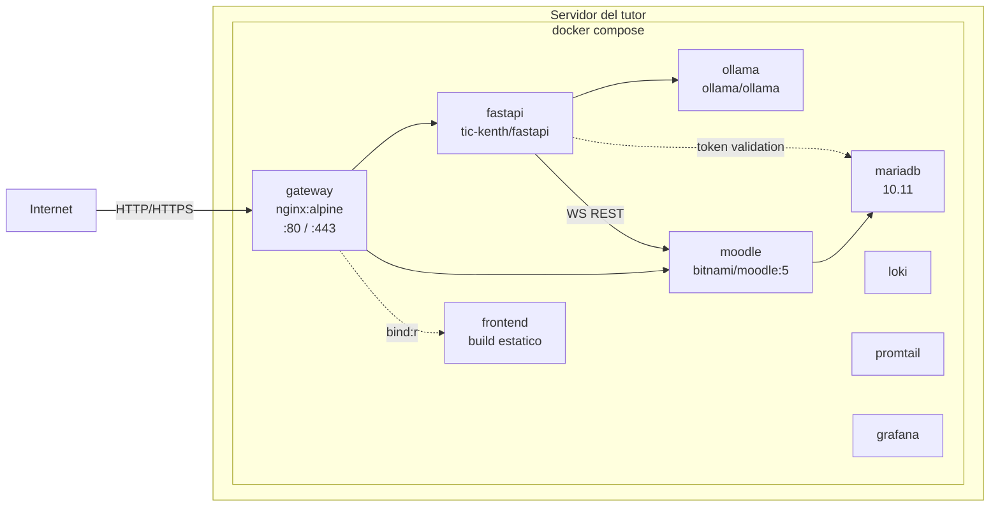
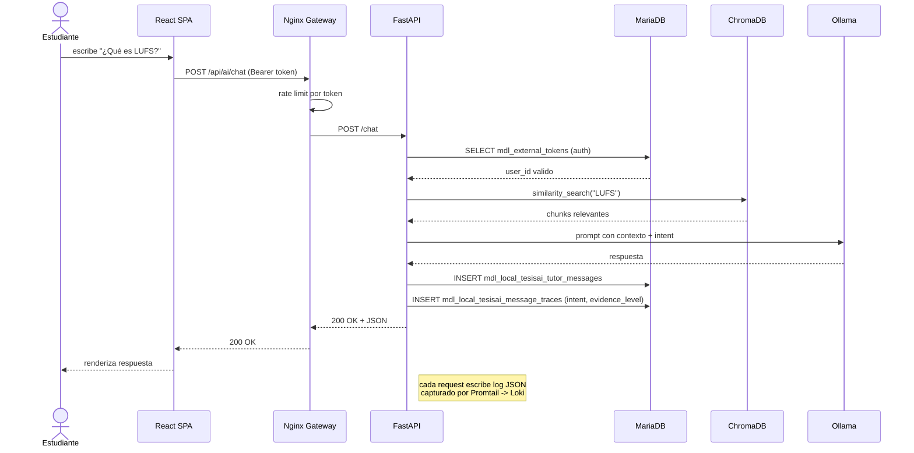

# Arquitectura del sistema TIC KENTH

Este documento es la referencia tecnica del sistema y la fuente para el
Capitulo IV §4.2.1 de la tesis. Describe el patron arquitectonico,
componentes, contratos entre servicios y decisiones tomadas.

## 1. Patron arquitectonico

El sistema sigue el patron **Arquitectura Orientada a Servicios (SOA) con
API Gateway**. Los servicios se exponen detras de un unico punto de entrada
(Nginx) que centraliza enrutamiento, rate limiting y observabilidad.

Justificacion:

- **Desacoplamiento por contrato REST**: el frontend no conoce las URLs internas
  de FastAPI o Moodle; consume `/api/ai/*` y `/api/lms/*`.
- **Escalabilidad por servicio**: el servicio IA (FastAPI + Ollama) puede
  escalarse vertical/horizontalmente sin tocar Moodle.
- **Frontera unica de seguridad**: el gateway aplica rate limiting,
  saneamiento de headers y (cuando aplique) terminacion TLS.
- **Observabilidad centralizada**: todos los logs JSON convergen en Loki y
  se visualizan en Grafana, satisfaciendo el bloque "Logs / Trazas LMS" del
  diagrama de la nota conceptual.
- **Independencia de ubicacion fisica**: SOA no obliga a colocar los servicios
  en una misma maquina. Los contratos REST permiten desplegar cada servicio
  donde sea optimo (CPU/GPU, restricciones de red, requisitos del LMS).

## 1.1 Modos de operacion

El mismo codigo soporta dos modos sin cambios estructurales, solo variables de configuracion:

**Modo desarrollo (workstation Windows del estudiante)**
- XAMPP nativo provee Moodle (Apache :80 + MariaDB :3307) con el curso real y los
  plugins custom (`local_tesisai`, `proyecto_curso/api_persistente/`).
- `npm run dev` (Vite) sirve el SPA en :5173 con proxy: `/api/ai` -> `localhost:8000`, `/api/lms` -> `localhost:80`.
- `uvicorn main:app` ejecuta FastAPI en :8000, lee `OLLAMA_BASE_URL=http://localhost:11434`,
  `MOODLE_CONFIG_PATH=C:\Moodle\server\moodle\config.php` (donde extrae host/port/pass de MariaDB nativa).
- Ollama nativo en Windows escucha en :11434.
- ChromaDB persiste en `./bd_vectorial/`.
- No hay gateway fisico: el rol lo cumple el proxy de Vite. Este modo es estrictamente para iteracion.

**Modo despliegue (servidor del tutor)**
- `docker compose up -d` levanta gateway + frontend (bundle estatico) + fastapi + ollama + loki + promtail + grafana.
- Moodle vive fuera del compose: puede estar nativo en el mismo servidor o en otro host. El gateway
  apunta a el via el upstream `moodle_lms` (configurable en `nginx/nginx.conf`).
- El gateway escucha en :80 (`8090:80` en dev local de Windows, donde XAMPP ya ocupa 80).
- Los servicios consumen Moodle solo por contrato: Web Services REST para datos del LMS y MariaDB
  para validar `mdl_external_tokens` (frontera de auth).

La paridad entre ambos modos se garantiza usando los mismos prefijos `/api/ai` y `/api/lms` tanto en
el proxy de Vite (dev) como en el gateway Nginx (prod). El frontend nunca cambia segun el modo.

## 2. Diagrama de componentes

## 3. Diagrama de despliegue

## 4. Secuencia: el estudiante pregunta al tutor IA

## 5. Contratos entre servicios

### 5.1 Frontend ↔ Gateway

- `GET /api/lms/...` → cualquier endpoint del LMS (Moodle WebServices, plugin `local_tesisai`, `proyecto_curso/api_persistente`).
- `GET|POST /api/ai/...` → servicio IA (`/chat`, `/chat-sessions`, `/documents`, `/pilot`, `/moodle`).
- Auth: header `Authorization: Bearer <moodle_token>`. En desarrollo aislado: `X-User-Id`.

### 5.2 FastAPI ↔ Moodle

**Lecturas core (vía Web Services REST)**:
- `core_user_get_users_by_field`
- `core_course_get_contents`
- `gradereport_user_get_grade_items`
- `core_completion_get_activities_completion_status`
- funciones expuestas por `local_tesisai`

**Acceso directo a MariaDB (limitado)**:
- `mdl_external_tokens + mdl_external_services` → validar token (frontera de auth).
- `mdl_local_tesisai_*` → tablas del plugin propio del proyecto, contrato extendido por diseño.

Cualquier otro acceso directo al esquema interno de Moodle (`mdl_user`, `mdl_course`, `mdl_grade_*`, etc.) esta **prohibido** por el contrato SOA.

### 5.3 FastAPI ↔ Ollama / ChromaDB

- Ollama: cliente `langchain_ollama` apuntando a `OLLAMA_BASE_URL`.
- ChromaDB: cliente `langchain_chroma` con persistencia en volumen `chroma_data`.

## 6. Decisiones y trade-offs

| Decision | Alternativa descartada | Razon |
|---|---|---|
| Tokens Moodle nativos (no JWT) | OAuth2 + JWT firmado por gateway | Reusar `mdl_external_tokens` evita reescribir el login y mantener un IdP separado. La capa anti-tampering la da el secret de Moodle. |
| Acceso directo solo a `mdl_external_tokens` | WS para auth | El WS de Moodle exige token, lo que crearia bootstrap circular. La validacion de token es la unica frontera donde la BD es mas barata que un WS. |
| Bitnami Moodle en compose | Moodle nativo en XAMPP del servidor | Reproducibilidad: el stack se baja con un solo `docker compose up`. |
| Loki/Promtail/Grafana | ELK | Mucho mas ligero, sin Java, suficiente para piloto de 14 dias. |
| Ollama en contenedor | Servicio externo | Permite GPU passthrough opcional y aisla modelos por proyecto. |

## 7. Variables a confirmar con el tutor

| Variable | Estado | Decision pendiente |
|---|---|---|
| SO del servidor | Pendiente | Linux es el camino recomendado para `docker compose`. Si es Windows Server, validar Docker Desktop + WSL2. |
| GPU disponible | Pendiente | Si hay NVIDIA, descomentar bloque `deploy.resources.reservations.devices` en el compose. Permite usar `llama3.1:8b`. |
| Dominio publico vs IP interna ESPE | Pendiente | Define si activamos certbot (Let's Encrypt) o cert auto-firmado. |
| Reglas de firewall | Pendiente | Confirmar que el puerto 80/443 esta abierto al cliente final. |

## 8. Observabilidad para evidencia academica

El dashboard `tic-kenth-obs` provisionado en Grafana incluye:

- **Requests/min por servicio**: distribucion de carga gateway/fastapi.
- **Errores 4xx/5xx en el gateway**: salud del enrutamiento y rate limit.
- **Latencia p95 del tutor IA**: SLO medible para el capitulo de resultados.
- **Intents detectados**: histograma de intents pedagogicos resueltos por
  el tutor (aclaracion_concepto, diagnostico_tecnico, etc.), que sirve como
  evidencia operacional del Capitulo IV §4.6.3.

## 9. Bloqueadores conocidos

- Primer arranque de Ollama: 5-15 min para `ollama pull` de los modelos.
- Bitnami Moodle ignora `config.php` legacy: la migracion del curso ID 2
  requiere reproducir secciones, modulos y plugin `local_tesisai` despues del
  restore de BD (ver `scripts/migrate-moodle.md`).
- Promtail necesita acceso al socket de Docker. En Windows Server este path
  cambia; verificar al desplegar.
