# Diagramas — TIC KENTH

Diagramas en Mermaid (renderizables en GitHub/VS Code). Actualizados al cierre
funcional de julio 2026 (Sección 0 teacher-driven + H5P learning_signals +
tutor adaptativo). Diagramas 1–6: base del sistema; 7–11: flujo docente RAG,
señales H5P, contexto del tutor, estados de la guía y secuencia de defensa.

---

## 1. Arquitectura general (SOA tras API Gateway)

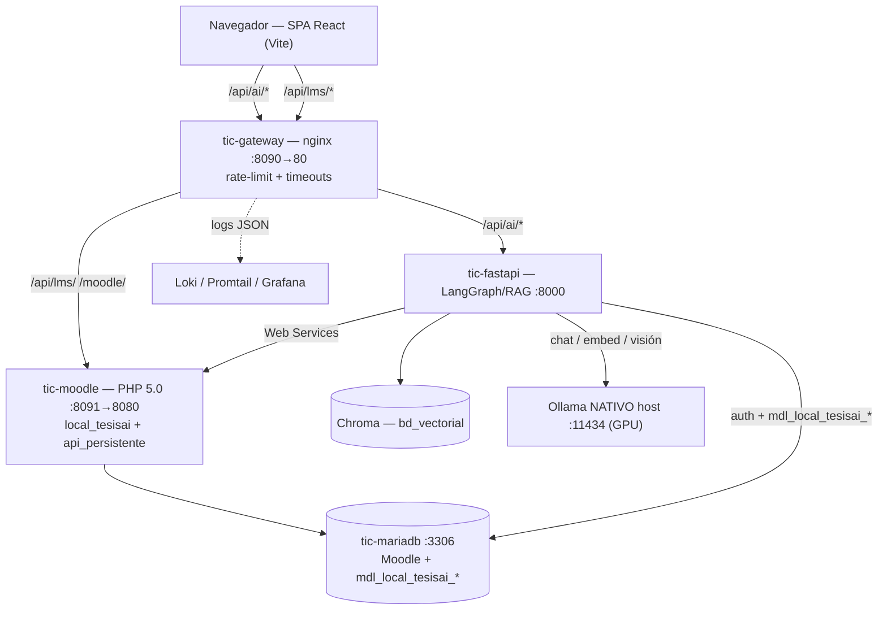

---

## 2. Componentes

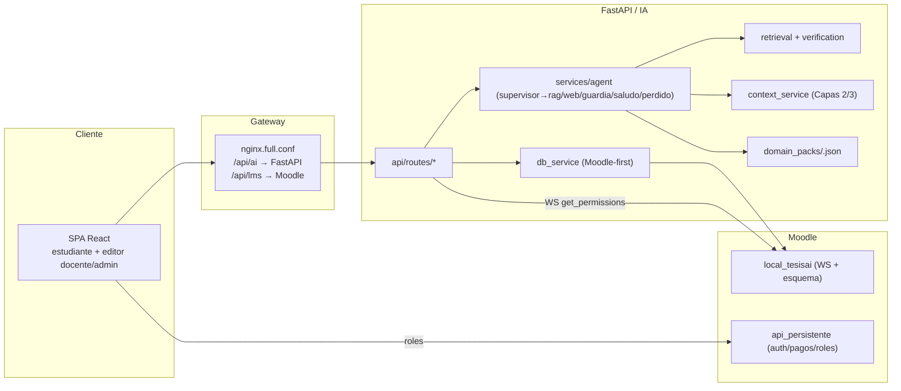

---

## 3. Secuencia — Estudiante → Tutor → RAG → Ollama → Respuesta

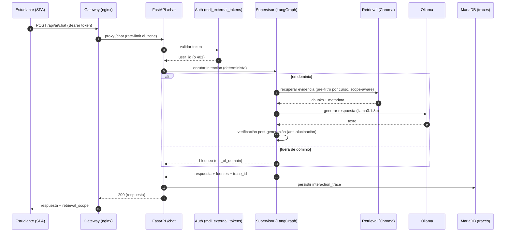

---

## 4. Secuencia — Profesor → ai-prepare → metadata → tutor

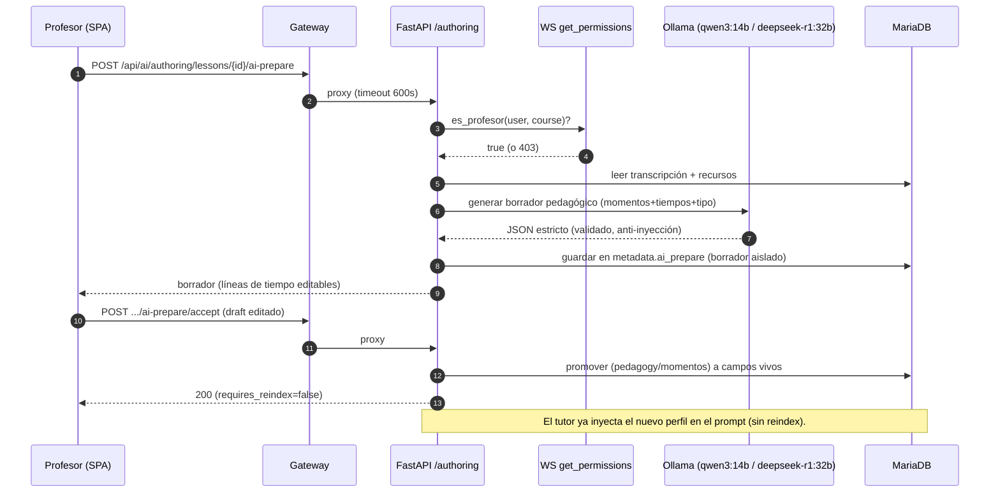

---

## 5. Autorización por roles / capabilities

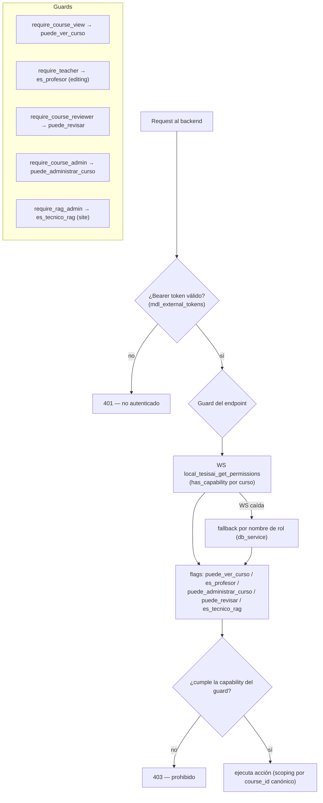

---

## 6. ERD simplificado — tablas `mdl_local_tesisai_*`

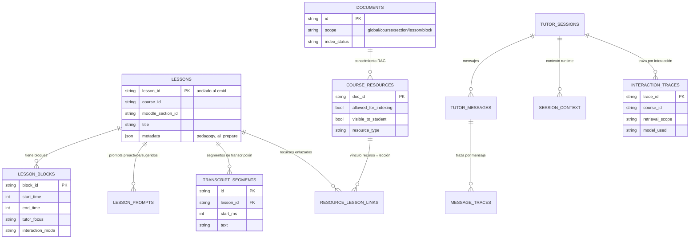

> Otras tablas del esquema: `local_tesisai_axes` (residual de la migración
> eje→sección, deuda técnica diferida). El ERD anterior muestra las 13 entidades
> operativas principales; el detalle de campos vive en
> `moodle/local_tesisai/db/install.xml`.

---

## 7. Teacher-driven RAG — el profesor alimenta el conocimiento sin tocar Markdown

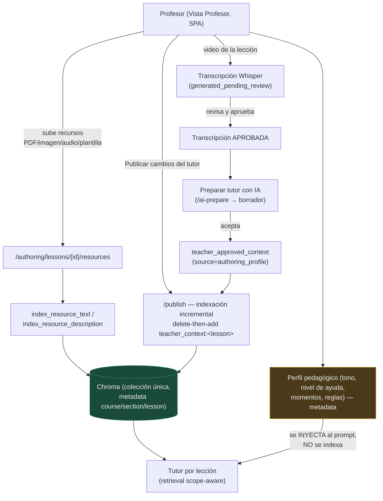

Principio **inject-vs-index**: el *conocimiento* (transcripción aprobada,
resource_text, resource_description, teacher_context) se **indexa** en Chroma;
el *comportamiento* (tono, nivel de ayuda, momentos, reglas, mensaje proactivo)
se **inyecta** en el prompt por lección. Sección 0: `canonical_md = 0` activo
(los 208 chunks canónicos fueron superseded por 35 recursos docentes reales).

---

## 8. H5P + learning signals — de la respuesta del estudiante a la guía del tutor

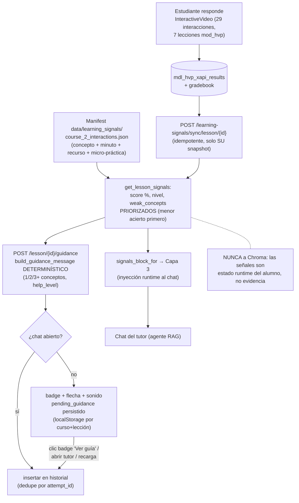

---

## 9. Contexto del tutor — qué ve el modelo al responder

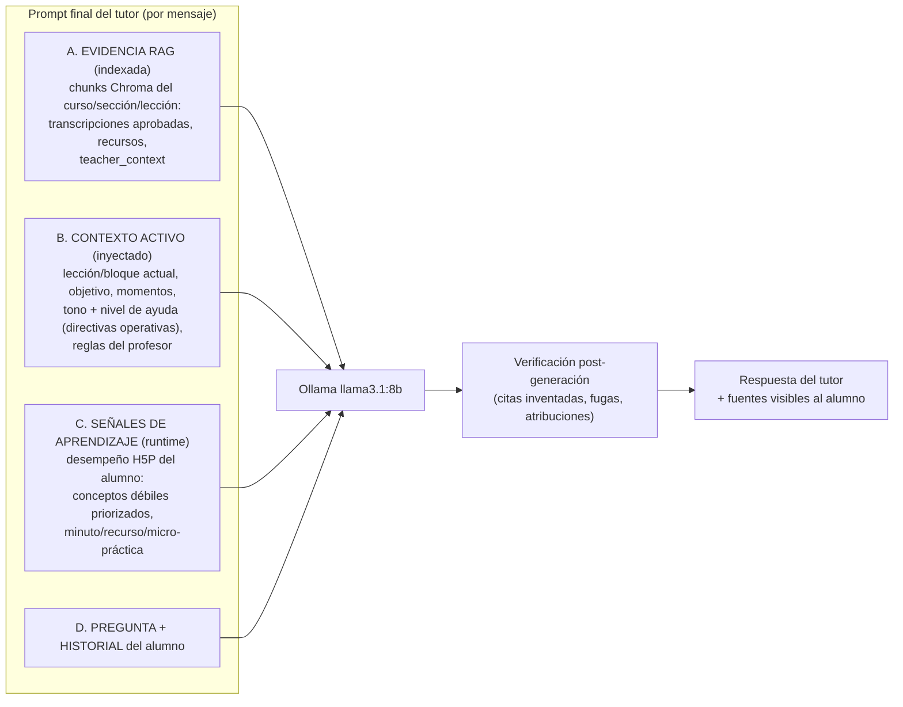

Separación estricta: A es **conocimiento verificable** (con fuentes); B y C son
**comportamiento/estado** — jamás entran a la query vectorial ni a Chroma.

---

## 10. Estados de la actividad H5P y de la guía del tutor

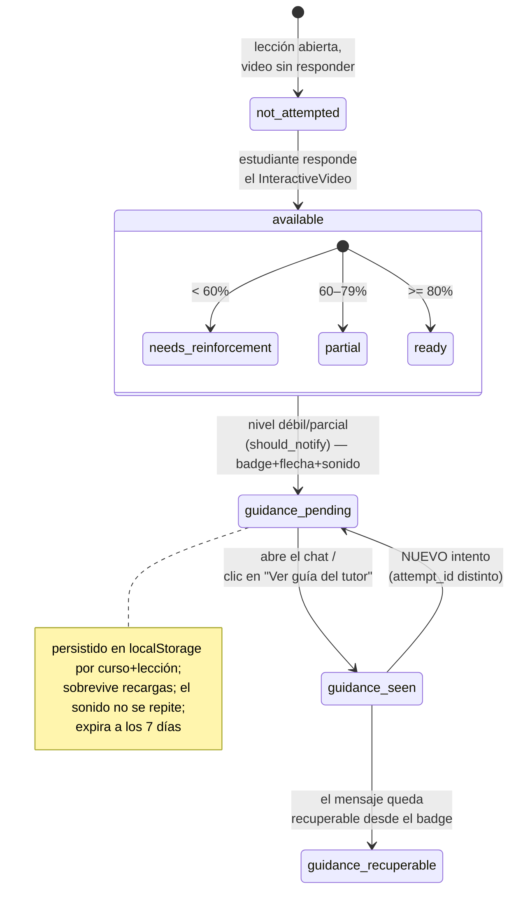

---

## 11. Secuencia de defensa (video 3 min) — login → lección → H5P → tutor orienta

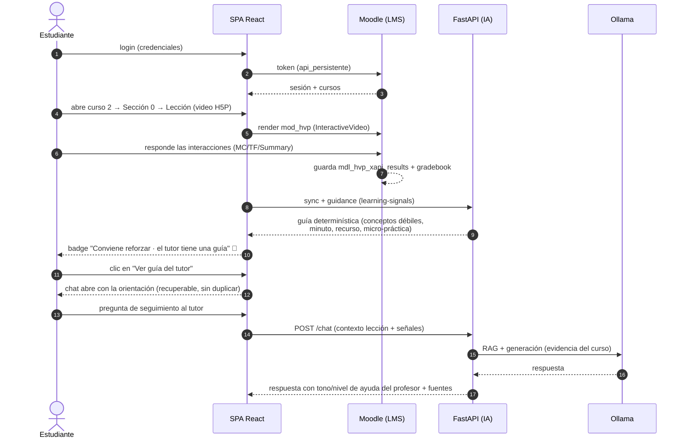
