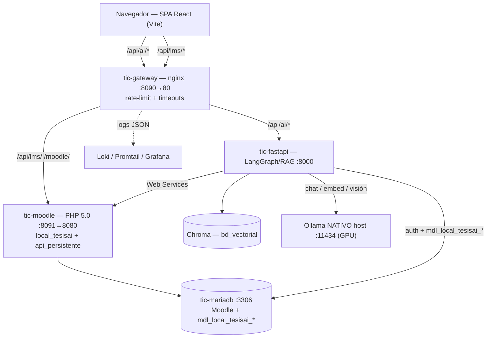
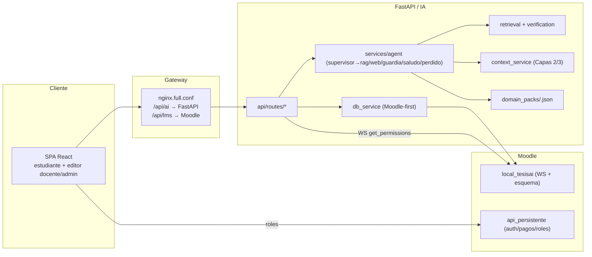
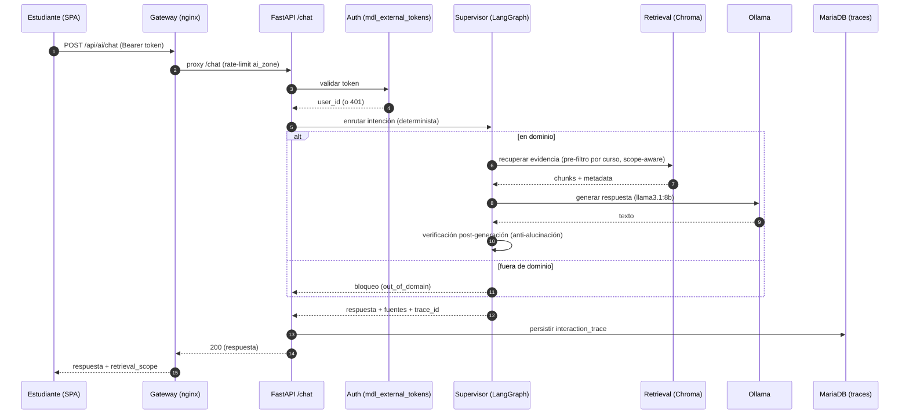
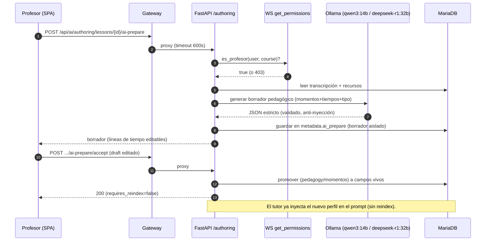
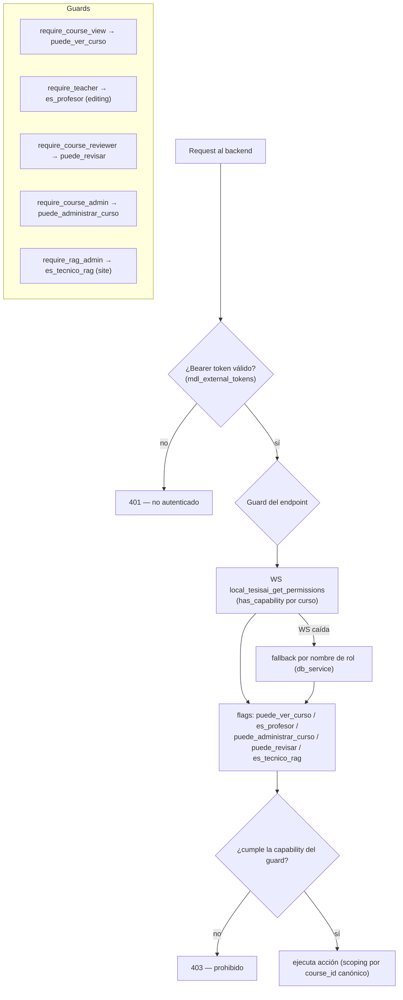

# Diagramas — TIC KENTH

Diagramas en Mermaid (renderizables en GitHub/VS Code). Reflejan el sistema
desplegado (`AUDITORIA_TIC_READYNESS.md`, commit `6b25712`).

---

## 1. Arquitectura general (SOA tras API Gateway)

---

## 2. Componentes

---

## 3. Secuencia — Estudiante → Tutor → RAG → Ollama → Respuesta

---

## 4. Secuencia — Profesor → ai-prepare → metadata → tutor

---

## 5. Autorización por roles / capabilities

---

## 6. ERD simplificado — tablas `mdl_local_tesisai_*`

> Otras tablas del esquema: `local_tesisai_axes` (residual de la migración
> eje→sección, deuda técnica diferida). El ERD anterior muestra las 13 entidades
> operativas principales; el detalle de campos vive en
> `moodle/local_tesisai/db/install.xml`.
